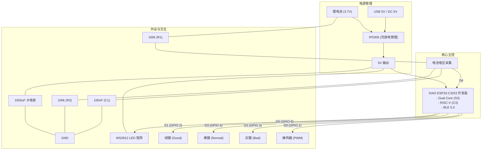

# Pixel Caddy - 产品核心文档 (Product Core)

## 1. 产品概述
Pixel Caddy 是一款智能高尔夫/运动球类训练辅助设备，旨在帮助用户实时记录训练数据，并自动统计训练表现。

## 2. 核心功能
*   **📊 实时记分系统**: 通过 3 个物理按键记录 "Good" (好球)、"Normal" (普通)、"Bad" (坏球)。
*   **📈 阶梯结算系统**: 
    *   **小组结算**: 每 10 球为一组，自动显示本组 G/N/B 统计。
    *   **全场结算**: 完成 10 组后，显示全场占比 (%) 与总项统计。
*   **📸 蓝牙遥控快门**: 模拟蓝牙 HID 键盘，自动控制手机或相机快门进行训练录像。
*   **🕒 时间自动同步**: 通过手机蓝牙连接自动同步 RTC 时间。
*   **💾 数据持久化**: 掉电不丢失数据，累计记录 100 组 (1000球) 历史数据。
*   **📶 远程更新 (ElegantOTA)**: 支持通过浏览器无线更新固件。
*   **💤 智能节电**: 10 分钟无操作自动进入屏保模式。

## 3. 硬件架构
### 3.1 核心主控
支持 **Seeed Studio XIAO** 系列开发板：
*   **ESP32-C3**: 基础版，功耗低，单核 RISC-V。
*   **ESP32-S3**: 增强版，双核 LX7，性能更强。

### 3.2 关键外设
*   **显示屏**: 16x16 NeoMatrix LED 阵列 (WS2812)。
*   **电源管理**: IP5306 (充放电 SoC)。XIAO 模块直接由 IP5306 输出的 5V 供电。
*   **反馈**: 无源蜂鸣器 (NPN 三极管驱动)。
*   **辅助供电**: 预留 5V 5025 DC 插座，支持充电与直接供电 (连接至 IP5306 VIN)。
*   **电容配置**:
    *   IP5306: 10uF (BAT), 22uF (VOUT)。
    *   LED 矩阵: 1000uF 电解电容稳压。

## 3.3 硬件原理图 (Schematics)

## 4. 硬件连线方案 (Pin Mapping)

| 功能模块 | XIAO 引脚 | GPIO (ESP32-C3) | GPIO (ESP32-S3) | 备注 |
| :--- | :--- | :--- | :--- | :--- |
| **LED 矩阵** | **D9** | GPIO 9 | **GPIO 8** | WS2812 DIN |
| **绿键 (Good)** | **D1** | GPIO 3 | **GPIO 2** | 内部上拉 |
| **黄键 (Normal)** | **D3** | GPIO 5 | **GPIO 4** | 内部上拉 |
| **红键 (Bad)** | **D2** | GPIO 4 | **GPIO 3** | 内部上拉 |
| **蜂鸣器** | **D0** | GPIO 2 | **GPIO 1** | PWM 输出 |
| **电量采集** | **D4** | GPIO 4 | **GPIO 5** | 电压分压 1/2 |

## 5. 软件特性
*   **环形缓冲区 (Ring Buffer)**: 保证最新的训练数据始终可查。
*   **低功耗管理**: 支持熄屏及背光调节。
*   **蓝牙协议**: 同时支持 BLE HID (遥控) 和 BLE Data Service (同步)。
